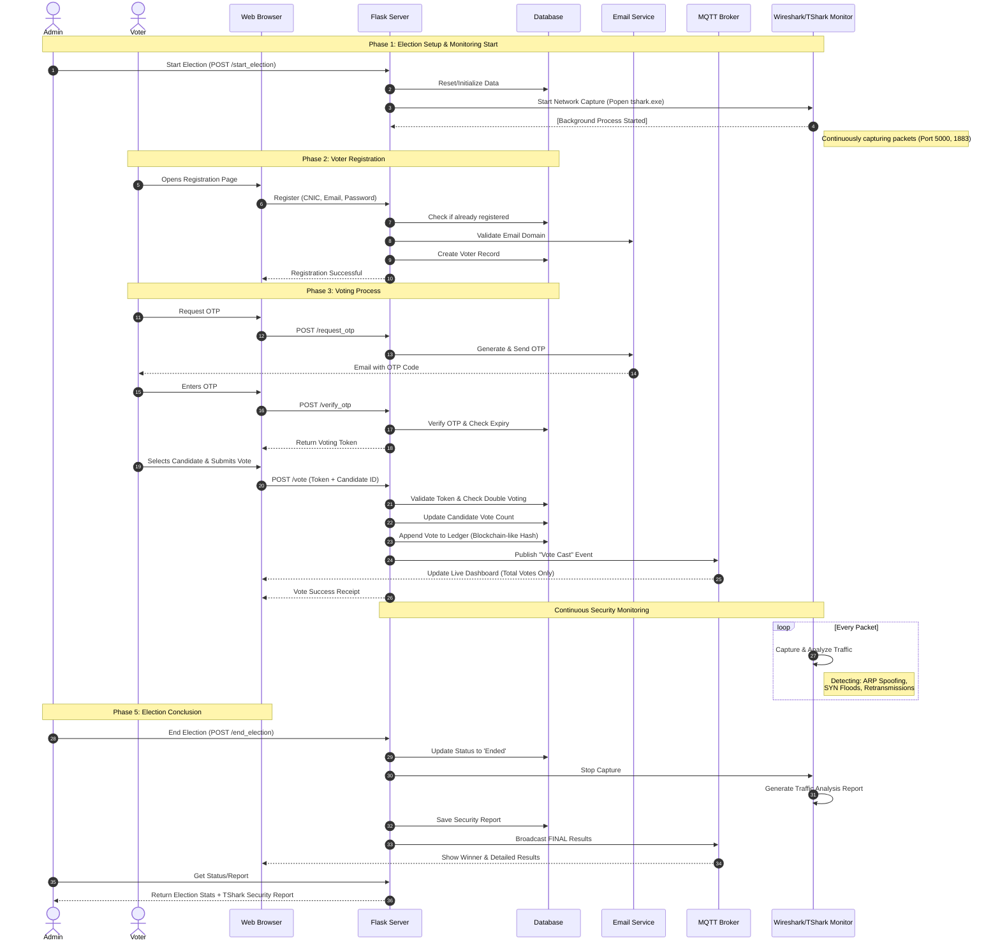
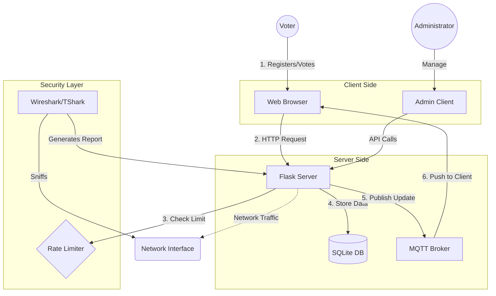

# Project Flow Diagrams

## 1. Sequence Diagram (Step-by-Step Flow)

This diagram shows the detailed step-by-step interaction between all system components, including the security monitoring by Wireshark/TShark.

## 2. System Architecture (Component View)

