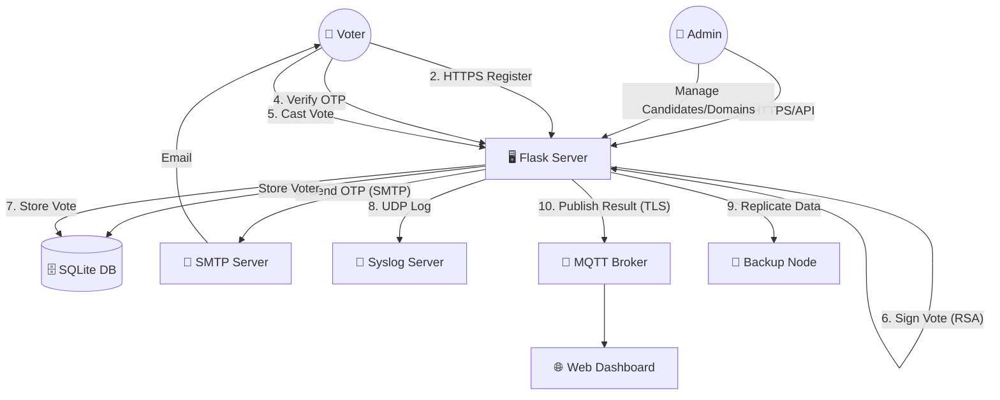

# 🗳️ Secure E-Voting System - Project Report

## 1. Executive Summary
The **Secure E-Voting System** is a robust, full-stack electronic voting solution designed to ensure **integrity, secrecy, and transparency** in elections. Built with a focus on network security, the system mitigates common threats such as data tampering, unauthorized access, and Denial of Service (DoS) attacks. It features a modern web interface for voters, a command-line admin panel, and a suite of background services for monitoring and redundancy.

---

## 2. Key Features

### 🛡️ Security & Integrity
*   **RSA Digital Signatures**: Every vote cast is cryptographically signed using a private key. This ensures that votes cannot be altered in the database without invalidating the signature.
*   **Blockchain-Inspired Ledger**: Votes are chained together using hashes (`prev_hash` + `current_data`), making the ledger immutable. Any tamper attempts break the chain.
*   **Two-Factor Authentication (2FA)**: Voters authenticate via **CNIC** and a **One-Time Password (OTP)** sent to their verified email domain (e.g., `@university.edu`).
*   **DoS/DDoS Protection**: Integrated Rate Limiting blocks IP addresses that flood the server with excessive requests.
*   **TLS/SSL Encryption**: All communication between clients, the server, and the MQTT broker is encrypted to prevent eavesdropping.

### 📡 Real-Time & Networking
*   **Live Updates**: Uses **MQTT (Mosquitto Broker)** to push real-time vote counts to the dashboard without requiring page refreshes.
*   **Traffic Analysis**: A background **Traffic Monitor** captures packets using TShark/Wireshark to analyze network behavior and generate security reports.
*   **Distributed Redundancy**: A **Backup Node** runs in parallel, replicating data in real-time to ensure no data is lost if the main node fails.
*   **Centralized Logging**: A **Syslog Server** (UDP) collects audit logs from all components for security monitoring.

### 💻 User Experience
*   **Responsive Web Portal**: A beautiful, dark-themed web interface for registration, voting, and verification.
*   **Vote Verification**: Voters receive a **Vote ID** and **Hash Receipt** to independently verify their vote's inclusion in the ledger.
*   **Admin CLI**: A powerful command-line tool for managing candidates, email domains, and election lifecycle.

---

## 3. Technology Stack

| Component | Protocol / Standard | Usage in Project |
| :--- | :--- | :--- |
| **Web Access** | **HTTPS** (HTTP over TLS) | Secure, encrypted voter portal access (`https://localhost:5000`) |
| **Transport Layer** | **TCP** | Reliable transmission for Web and MQTT traffic |
| **Real-Time Data** | **MQTT** (over **SSL/TLS**) | Secure Publish-Subscribe messaging for live results |
| **Authentication** | **SMTP** | Sending OTP codes to external mail servers |
| **Logging System** | **UDP** | Connectionless, low-latency audit log transmission |
| **Encryption** | **TLS / SSL** | End-to-end encryption for all TCP connections |

---

## 4. System Architecture

1.  **Voter Client**: Web browser accessing `https://localhost:5000`. Authenticates via Email/OTP.
2.  **Main Server**: Flask application handling HTTP requests. It acts as the central authority, signing votes and storing them in `voting.db`.
3.  **MQTT Broker**: Intermediary for broadcasting "Vote Cast" events to all connected clients securely.
4.  **Admin Client**: Python script sending authenticated requests to the server to manage the election.
5.  **Backup Node**: Continuous polling service that syncs with the Main Server's database.
6.  **Health Monitor**: "Heartbeat" script that pings all services and sends email alerts if any service goes down.

### 🔄 Data Flow Diagram

---

## 5. Security Implementation Details

### Digital Signature Workflow
1.  **Vote Construction**: `Payload = Prev_Hash | Candidate_ID | Timestamp`
2.  **Signing**: The server signs the `Payload` using its **RSA Private Key**.
3.  **Verification**: Any client can use the **Public Key** to verify that the signature matches the payload.

### DoS Protection Logic
*   **Algorithm**: Token Bucket / Fixed Window Counter.
*   **Rule**: Max **30 requests per minute** per IP address.
*   **Action**: If limit exceeded, return `HTTP 429 Too Many Requests`.

### Network Traffic Analysis
*   The system captures `.pcap` files during the election.
*   It analyzes packet headers to detect anomalies (e.g., SYN floods or unauthorized port access).
*   A **Layman Report** is generated at the end of the election summarizing network activity.

---

## 6. How to Run

1.  **Start Infrastructure**:
    *   `./start_broker.ps1` (MQTT Broker)
    *   `python log_server.py` (Syslog)
2.  **Start Core Services**:
    *   `python server.py` (Main Server)
    *   `python backup_node.py` (Data Backup)
3.  **Start Monitoring**:
    *   `python health_monitor.py`
    *   `python traffic_monitor.py`
4.  **Access**:
    *   **Voter**: Open `https://localhost:5000`
    *   **Admin**: Run `python admin_client.py`

---

## 7. Conclusion
This project demonstrates a comprehensive approach to secure electronic voting. By layering cryptographic proofs, network security protocols, and robust application logic, it creates a system that is not only functional but also verifiable and resilient against modern cyber threats.
